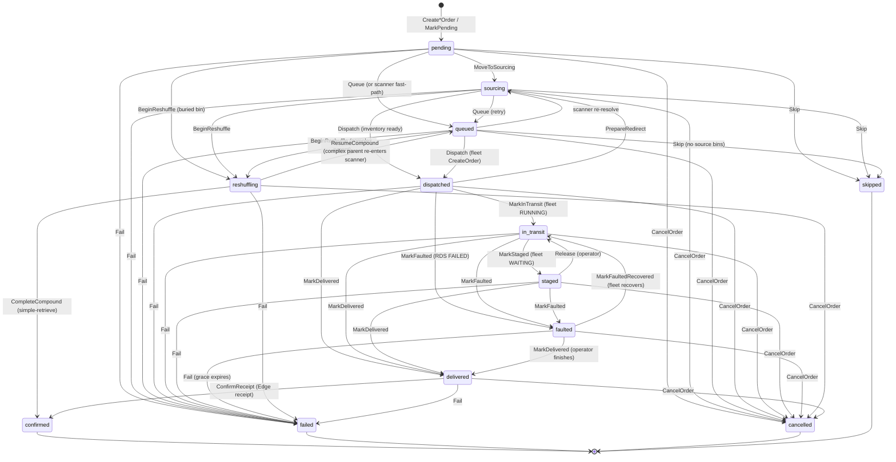
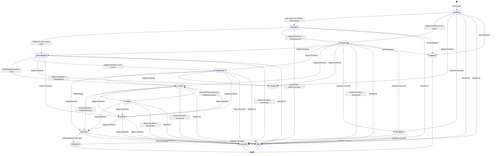

# Order Status Lifecycle

**What this is:** the order lifecycle status vocabulary as it exists in the code
today — every status × who writes it × who reads it × what the operator sees.
Grounded in `protocol/status.go` (the enum), `protocol/types.go`
(`validTransitions` — the canonical state machine), the Core lifecycle
(`shingo-core/dispatch/lifecycle.go`), the Edge lifecycle
(`shingo-edge/orders/lifecycle_service.go`, `manager.go`), and the operator
HMI (`shingo-edge/www/static/operator-station/`). The code wins over this doc;
if they disagree, fix the doc.

---

## Two machines, one enum

The order-status enum is a superposition of **two state machines** that share
one string:

- **Core's planning machine** — the truth of *what Core is doing with the
  order*: is it hunting bins, queued behind a capacity gate, handed to the
  fleet, or done? Core's statuses are **planning truth**.
- **Edge's submission machine** — the truth of *what the operator at the line
  sees*: the order envelope was created and submitted, Core acknowledged it,
  a robot is moving, a bin has arrived. Edge's statuses are **submission /
  display truth**.

Most statuses mean the same thing on both sides (a `delivered` order has a bin
at the destination, period). Two are Edge-lifecycle words in practice:

- **`submitted`** — Edge's word for "the order envelope is in my outbox." Core
  has a lifecycle method that *could* write it, but Core's dispatcher never
  produces a `submitted` row; it is Edge-only in practice.
- **`acknowledged`** — on Edge, it means *Core acknowledged Edge's submission*
  (the intake ACK Core sends before sourcing begins). On Core it would mean
  *the fleet acknowledged Core's vendor order* — but the fleet adapter's
  `MapState` (`shingo-core/fleet/seerrds/mappers.go`) maps RDS states to
  `dispatched` / `in_transit` / `staged` / `delivered` / `faulted` / `cancelled`
  and never returns `acknowledged`. Core's `Acknowledge` call site is a
  defensive, never-fires arm (documented as such in
  `shingo-core/engine/wiring_vendor_status.go`). So `acknowledged`, like
  `submitted`, is an Edge-lifecycle word in practice.

Edge mirrors Core's **full** status vocabulary: a status Core pushes that Edge
previously discarded (`sourcing`, `dispatched`, `faulted`) is now stored on the
Edge row by a single mapping function (`orders.ApplyCoreStatus`), so the
operator is shown the truth of whichever machine owns the order at that moment.

---

## The lifecycle table

**Status roster** (`protocol/status.go`): `pending`, `sourcing`, `queued`,
`submitted`, `dispatched`, `acknowledged`, `in_transit`, `delivered`,
`confirmed`, `staged`, `faulted`, `failed`, `cancelled`, `reshuffling`,
`skipped` — 15 values.

**Terminal** = no outgoing edge in `validTransitions` (`protocol.IsTerminal`,
derived, not hand-maintained): **confirmed, failed, cancelled, skipped**.

| Status | Scope | Terminal | Core writes | Edge writes | Crosses wire? | What the operator sees |
|---|---|---|---|---|---|---|
| `pending` | shared | no | intake (`MarkPending`) | local create | no (each side's own zero value) | Submit button on Edge list; Core UI badge |
| `sourcing` | shared | no | `MoveToSourcing` (reserve start, held-bin re-dispatch, redirect re-shop) | **`ApplyCoreStatus`** (live push + snapshot) | yes (`order.update` + snapshot) | HMI: "SOURCING: \<reason\>" (same family as IN QUEUE) |
| `queued` | shared | no | `Queue`, `ResumeCompound` | `ReplyQueued` + `ApplyCoreStatus` | yes (`order.update`) | "IN QUEUE: \<queue_reason\>"; badge on both lists |
| `submitted` | Edge-only (in practice) | no | not produced by the dispatcher | local create auto-submit, `SubmitOrder` | no (Edge-local) | Edge UI badge; absent from window cards |
| `dispatched` | shared | no | `Dispatch` (after fleet `CreateOrder`) | **`ApplyCoreStatus`** (live push + snapshot) | yes (`order.update` + snapshot) | Core filter chip; Edge mirrors when Core pushes it |
| `acknowledged` | Edge-only (in practice) | no | defensive `Acknowledge` arm — never fires (`MapState` doesn't return it) | `ReplyAck` (Core's intake ACK, pre-sourcing) | yes (`order.ack`) | HMI: **"ACKNOWLEDGED"** — its own step, NOT "IN TRANSIT" |
| `in_transit` | shared | no | `MarkInTransit`, `Release`, `MarkFaultedRecovered` | `ReplyWaybill` (waybill + ETA) + `ApplyCoreStatus` | yes (waybill + `order.update`) | "IN TRANSIT" + ETA pill |
| `staged` | shared | no | `MarkStaged` | `ReplyStaged` (`order.staged` envelope) | yes (`order.staged`) | Release button + expiry countdown |
| `delivered` | shared | no | `MarkDelivered` | `HandleDelivered` (`order.delivered` w/ bin snapshot) | yes (`order.delivered`) | Confirm button; HMI "DELIVERED" |
| `confirmed` | shared | **yes** | `ConfirmReceipt`, `CompleteCompound` | operator confirm (`ConfirmDelivery`) | yes (receipt Edge→Core) | disappears (done) |
| `faulted` | shared | no | `MarkFaulted` (RDS FAILED, grace period) | **`ApplyCoreStatus`** (live push + snapshot) | yes (`order.update` + snapshot) | amber left-edge border on the orders list |
| `failed` | shared | **yes** | `Fail` | `ReplyError` (`order.error`) | yes (`order.error`) | stays visible (retry/ack) |
| `cancelled` | shared | **yes** | `CancelOrder` | operator abort + `ReplyCancelled` | yes (both directions) | disappears |
| `reshuffling` | shared | no | `BeginReshuffle`, `MarkReshuffling` | snapshot arm only | snapshot at reconnect | Core filter chip; HMI mostly n/a |
| `skipped` | shared | **yes** | `Skip` (no source bins) | `HandleSkipped` (`order.skipped`) | yes (`order.skipped`) | "Auto-skipped" chip, not an alarm |

**Scope key:** *shared* = the string is shared vocabulary; both sides validate
against `validTransitions`. *Edge-only (in practice)* = Core has the constant
and the edges in the table (Edge validates against them) but never produces a
row in that status.

---

## Core's planning machine

Core owns the order from intake through fleet handoff and terminal resolution.
Pre-fleet it plans (`pending` → `queued` / `sourcing`); at dispatch it hands
off to the fleet (`dispatched` → `in_transit` → `staged` / `delivered`);
faulted is a grace-period branch; reshuffling is the compound-parent loop.
Every edge below is a row in `protocol.validTransitions`.



Notes on the Core machine:

- **`acknowledged` is not drawn** — `MapState` never produces it; Core's vendor
  ladder starts at `dispatched`. The `acknowledged → {...}` edges exist in the
  shared table (Edge uses them) but Core never enters the state.
- **`submitted` is not drawn** — Edge's word; Core never writes it.
- **Reshuffle loop:** `reshuffling → queued (ResumeCompound)` is the complex
  parent re-entering the scanner after its children complete; simple-retrieve
  compounds terminate at `confirmed`.

---

## Edge's submission machine

Edge owns the order envelope from local creation through operator confirmation.
It mirrors Core's planning status when Core pushes it (via `ApplyCoreStatus`),
and independently tracks its own submission lifecycle
(`pending` → `submitted` → `acknowledged`). The statuses the mapping newly
lets Edge store — `sourcing`, `dispatched`, `faulted` — appear here because
Core pushes them over `order.update`; Edge transitions through them exactly as
the shared table permits.



Notes on the Edge machine:

- **`ApplyCoreStatus`** (`shingo-edge/orders/lifecycle_service.go`) maps Core's
  pushed status onto the Edge row. Its arms are
  `queued` / `sourcing` / `dispatched` / `in_transit` / `faulted` → `Transition`
  (validated against `validTransitions`, no-op on same-status/terminal).
  `staged` / `delivered` / terminal statuses are **no-ops here** — they are
  owned by dedicated envelopes (`order.staged`, `order.delivered`, `order.error`,
  `order.skipped`, `order.cancelled`) that carry the extra fields (bin snapshot,
  expiry, reason) this generic mapping does not have.
- **Graceful no-op:** if Core pushes a status that isn't reachable from Edge's
  current status in the shared table (26 such `(from, to)` pairs exist by
  design — e.g. `in_transit → queued`), `Transition` returns an error and both
  callers log-and-swallow it. The push is a no-op, matching the old discard
  behavior. No `validTransitions` edges are added to make a push land.

---

## The wire crossing

Core and Edge are two processes (Core on a Proxmox VM, Edge on a Pi at the
line). They communicate over Kafka order-channel envelopes. The two machines
agree on the enum but each owns different transitions; the wire is where they
reconcile.

**Core → Edge:**

- `order.ack` — Core's intake ACK (sent before sourcing begins). Edge writes
  `acknowledged`.
- `order.update` — carries `status` + `detail` + `queue_reason` (+ ETA into
  `in_transit`). Edge routes the status through `ApplyCoreStatus`
  (`HandleOrderUpdate` → `HandleCoreStatusPush`); `queued` / `sourcing` /
  `dispatched` / `in_transit` / `faulted` now update the Edge row, while ETA
  and `queue_reason` are side-written regardless.
- Dedicated envelopes for the statuses the generic mapping does NOT own:
  `order.waybill` (waybill id + ETA → `in_transit`), `order.staged` (→
  `staged`), `order.delivered` (→ `delivered`, with bin snapshot),
  `order.error` (→ `failed`), `order.skipped` (→ `skipped`, also advances a
  linked changeover node task), `order.cancelled` (→ `cancelled`).
- `OrderStatusSnapshot` — at startup reconciliation, Edge asks Core for the
  authoritative status of its active orders and force-reconciles each row
  (`ApplyCoreStatusSnapshot`).

**Edge → Core:**

- Order submission (the envelope in Edge's outbox).
- `order.cancel` (operator abort), `order.redirect` (delivery-node change),
  `order.release` (release-from-staging), and the delivery receipt
  (`order.receipt`, confirmed with final count).

```mermaid
flowDiagram LR
    subgraph Core[Core - planning machine]
        CPlan[queued / sourcing]
        CFleet[dispatched -> in_transit -> staged / delivered]
    end
    subgraph Edge[Edge - submission machine]
        ESub[submitted -> acknowledged]
        EMirror[mirrors sourcing / dispatched / faulted / in_transit]
        ETerm[staged / delivered / confirmed]
    end

    CPlan -- "order.update (status+reason)" --> EMirror
    CPlan -- "order.ack" --> ESub
    CFleet -- "order.waybill / staged / delivered" --> ETerm
    CFleet -- "order.update (faulted)" --> EMirror
    EMirror -- "snapshot reconcile at boot" -.-> Core

    ESub -- "submission" --> Core
    ETerm -- "release / receipt / cancel" --> Core
```
