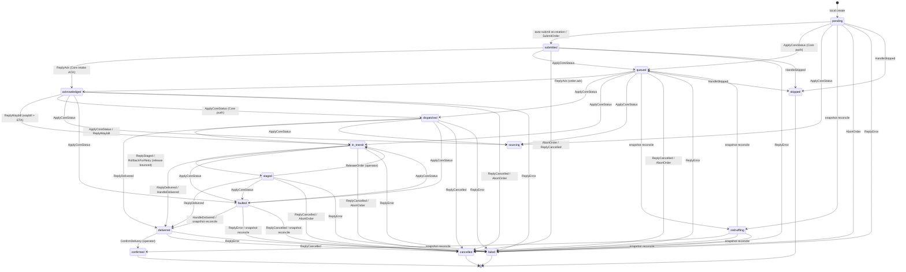

# Order Status Lifecycle

**What this is:** the order lifecycle status vocabulary as it exists in the code
today — every status × who writes it × who reads it × what the operator sees.
Grounded in `protocol/status.go` (the enum), `protocol/types.go`
(`validTransitions` — the canonical state machine), the Core lifecycle
(`shingo-core/dispatch/lifecycle.go`), the Edge lifecycle
(`shingo-edge/orders/lifecycle_service.go`, `manager.go`), and the operator
HMI (`shingo-edge/www/static/operator-station/`). The code wins over this doc;
if they disagree, fix the doc.

---

## Two machines, one enum

The order-status enum is a superposition of **two state machines** that share
one string:

- **Core's planning machine** — the truth of *what Core is doing with the
  order*: is it hunting bins, queued behind a capacity gate, handed to the
  fleet, or done? Core's statuses are **planning truth**.
- **Edge's submission machine** — the truth of *what the operator at the line
  sees*: the order envelope was created and submitted, Core acknowledged it,
  a robot is moving, a bin has arrived. Edge's statuses are **submission /
  display truth**.

Most statuses mean the same thing on both sides (a `delivered` order has a bin
at the destination, period). Two are Edge-lifecycle words in practice:

- **`submitted`** — Edge's word for "the order envelope is in my outbox." Core
  has a lifecycle method that *could* write it, but Core's dispatcher never
  produces a `submitted` row; it is Edge-only in practice.
- **`acknowledged`** — on Edge, it means *Core acknowledged Edge's submission*
  (the intake ACK Core sends on accepting the submission). On Core it would mean
  *the fleet acknowledged Core's vendor order* — but the fleet adapter's
  `MapState` (`shingo-core/fleet/seerrds/mappers.go`) maps RDS states to
  `dispatched` / `in_transit` / `staged` / `delivered` / `faulted` / `cancelled`
  and never returns `acknowledged`. Core's `Acknowledge` call site is a
  defensive, never-fires arm (documented as such in
  `shingo-core/engine/wiring_vendor_status.go`). So `acknowledged`, like
  `submitted`, is an Edge-lifecycle word in practice.

Edge mirrors Core's **full** status vocabulary: a status Core pushes that Edge
previously discarded (`sourcing`, `dispatched`, `faulted`) is now stored on the
Edge row by a single mapping function (`orders.ApplyCoreStatus`), so the
operator is shown the truth of whichever machine owns the order at that moment.

---

## The lifecycle table

**Status roster** (`protocol/status.go`): `pending`, `sourcing`, `queued`,
`submitted`, `dispatched`, `acknowledged`, `in_transit`, `delivered`,
`confirmed`, `staged`, `faulted`, `failed`, `cancelled`, `reshuffling`,
`skipped` — 15 values.

**Terminal** = no outgoing edge in `validTransitions` (`protocol.IsTerminal`,
derived, not hand-maintained): **confirmed, failed, cancelled, skipped**.

| Status | Scope | Terminal | Core writes | Edge writes | Crosses wire? | What the operator sees |
|---|---|---|---|---|---|---|
| `pending` | shared | no | intake — the INSERT (`orders.Create`) sets it | local create | no (each side's own zero value) | Submit button on Edge list; Core UI badge |
| `sourcing` | shared | no | `MoveToSourcing` (reserve start, held-bin re-dispatch, redirect re-shop, fleet-refusal demote) | **`ApplyCoreStatus`** (live push + snapshot) | yes (`order.update` + snapshot) | HMI: "SOURCING: \<reason\>" (same family as IN QUEUE) |
| `queued` | shared | no | `Queue`, `ResumeCompound` | `ApplyCoreStatus` (Core's `order.update`) | yes (`order.update`) | "IN QUEUE: \<queue_reason\>"; badge on both lists |
| `submitted` | Edge-only (in practice) | no | not produced by the dispatcher | local create auto-submit, `SubmitOrder` | no (Edge-local) | Edge UI badge; absent from window cards |
| `dispatched` | shared | no | `Dispatch` (the CAS claim, taken before the fleet create) | **`ApplyCoreStatus`** (live push + snapshot) | yes (`order.update` + snapshot) | Core filter chip; Edge mirrors when Core pushes it |
| `acknowledged` | Edge-only (in practice) | no | defensive `Acknowledge` arm — never fires (`MapState` doesn't return it) | `ReplyAck` (Core's intake ACK, pre-sourcing) | yes (`order.ack`) | HMI: **"ACKNOWLEDGED"** — its own step, NOT "IN TRANSIT" |
| `in_transit` | shared | no | `MarkInTransit`, `Release`, `MarkFaultedRecovered` | `ReplyWaybill` (waybill + ETA) + `ApplyCoreStatus` | yes (waybill + `order.update`) | "IN TRANSIT" + ETA pill |
| `staged` | shared | no | `MarkStaged` | `ReplyStaged` (`order.staged` envelope) | yes (`order.staged`) | Release button + expiry countdown |
| `delivered` | shared | no | `MarkDelivered` | `HandleDelivered` (`order.delivered` w/ bin snapshot) | yes (`order.delivered`) | Confirm button; HMI "DELIVERED" |
| `confirmed` | shared | **yes** | `ConfirmReceipt`, `CompleteCompound` | operator confirm (`ConfirmDelivery`), or `ApplyCoreStatus` force (Core-side confirm) | yes (receipt Edge→Core) | disappears (done) |
| `faulted` | shared | no | `MarkFaulted` (RDS FAILED, grace period) | **`ApplyCoreStatus`** (live push + snapshot) | yes (`order.update` + snapshot) | amber left-edge border on the orders list |
| `failed` | shared | **yes** | `Fail` | `ReplyError` (`order.error`) | yes (`order.error`) | stays visible (retry/ack) |
| `cancelled` | shared | **yes** | `CancelOrder` | operator abort + `ReplyCancelled` | yes (both directions) | disappears |
| `reshuffling` | shared | no | `BeginReshuffle` | snapshot arm only | snapshot at reconnect | Core filter chip; HMI mostly n/a |
| `skipped` | shared | **yes** | `Skip` (no source bins) | `HandleSkipped` (`order.skipped`) | yes (`order.skipped`) | "Auto-skipped" chip, not an alarm |

**Scope key:** *shared* = the string is shared vocabulary; both sides validate
against `validTransitions`. *Edge-only (in practice)* = Core has the constant
and the edges in the table (Edge validates against them) but never produces a
row in that status.

---

## Core's planning machine

Core owns the order from intake through fleet handoff and terminal resolution.
Pre-fleet it plans (`pending` → `queued` / `sourcing`); at dispatch it hands
off to the fleet (`dispatched` → `in_transit` → `staged` / `delivered`);
faulted is a grace-period branch; reshuffling is the compound-parent loop.
Every edge below is a row in `protocol.validTransitions`.

```mermaid
stateDiagram-v2
    [*] --> pending: Create*Order (the INSERT sets it)

    pending --> sourcing: MoveToSourcing
    pending --> queued: Queue (status-first intake queueing)
    pending --> reshuffling: BeginReshuffle (buried bin)
    pending --> cancelled: CancelOrder
    pending --> failed: Fail
    pending --> skipped: Skip

    sourcing --> queued: Queue (retry)
    sourcing --> dispatched: Dispatch (inventory ready)
    sourcing --> reshuffling: BeginReshuffle
    sourcing --> cancelled: CancelOrder
    sourcing --> failed: Fail
    sourcing --> skipped: Skip

    queued --> sourcing: scanner re-resolve
    queued --> dispatched: Dispatch (claim, then fleet CreateOrder)
    queued --> reshuffling: BeginReshuffle (complex parent)
    queued --> cancelled: CancelOrder
    queued --> failed: Fail
    queued --> skipped: Skip (no source bins)

    dispatched --> in_transit: MarkInTransit (fleet RUNNING)
    dispatched --> delivered: MarkDelivered
    dispatched --> sourcing: DemoteAfterFleetRefusal (fleet refused the create; PrepareRedirect is now refused past pre-dispatch)
    dispatched --> faulted: MarkFaulted (RDS FAILED)
    dispatched --> cancelled: CancelOrder
    dispatched --> failed: Fail

    in_transit --> staged: MarkStaged (fleet WAITING)
    in_transit --> delivered: MarkDelivered
    in_transit --> faulted: MarkFaulted
    in_transit --> cancelled: CancelOrder
    in_transit --> failed: Fail

    staged --> in_transit: Release (operator)
    staged --> delivered: MarkDelivered
    staged --> faulted: MarkFaulted
    staged --> cancelled: CancelOrder
    staged --> failed: Fail

    faulted --> in_transit: MarkFaultedRecovered (fleet recovers)
    faulted --> delivered: MarkDelivered (operator finishes)
    faulted --> failed: Fail (grace expires)
    faulted --> cancelled: CancelOrder

    reshuffling --> confirmed: CompleteCompound (simple-retrieve)
    reshuffling --> queued: ResumeCompound (complex parent re-enters scanner)
    reshuffling --> cancelled: CancelOrder
    reshuffling --> failed: Fail

    delivered --> confirmed: ConfirmReceipt (Edge receipt)
    delivered --> cancelled: CancelOrder
    delivered --> failed: Fail

    confirmed --> [*]
    failed --> [*]
    cancelled --> [*]
    skipped --> [*]
```

Notes on the Core machine:

- **`acknowledged` is not drawn** — `MapState` never produces it; Core's vendor
  ladder starts at `dispatched`. The `acknowledged → {...}` edges exist in the
  shared table (Edge uses them) but Core never enters the state.
- **`submitted` is not drawn** — Edge's word; Core never writes it.
- **Reshuffle loop:** `reshuffling → queued (ResumeCompound)` is the complex
  parent re-entering the scanner after its children complete; simple-retrieve
  compounds terminate at `confirmed`.
- **`dispatched → sourcing` is the refusal door** — `DemoteAfterFleetRefusal`
  ("armor off, paper kept") is its live writer. `HandleOrderRedirect` now
  refuses anything not pre-dispatch, so `PrepareRedirect` no longer produces
  this edge.

---

## Edge's submission machine

Edge owns the order envelope from local creation through operator confirmation.
It mirrors Core's planning status when Core pushes it (via `ApplyCoreStatus`),
and independently tracks its own submission lifecycle
(`pending` → `submitted` → `acknowledged`). The statuses the mapping newly
lets Edge store — `sourcing`, `dispatched`, `faulted` — appear here because
Core pushes them over `order.update`; Edge transitions through them exactly as
the shared table permits.

```mermaid
stateDiagram-v2
    [*] --> pending: local create

    pending --> submitted: auto-submit at creation / SubmitOrder
    pending --> queued: ApplyCoreStatus (Core push)
    pending --> sourcing: ApplyCoreStatus
    pending --> reshuffling: snapshot reconcile
    pending --> cancelled: AbortOrder
    pending --> failed: ReplyError
    pending --> skipped: HandleSkipped

    submitted --> acknowledged: ReplyAck (Core intake ACK)
    submitted --> queued: ApplyCoreStatus
    submitted --> cancelled: AbortOrder / ReplyCancelled
    submitted --> failed: ReplyError
    submitted --> skipped: HandleSkipped

    acknowledged --> in_transit: ReplyWaybill (waybill + ETA)
    acknowledged --> dispatched: ApplyCoreStatus (Core push)
    acknowledged --> sourcing: ApplyCoreStatus
    acknowledged --> faulted: ApplyCoreStatus
    acknowledged --> cancelled: ReplyCancelled / AbortOrder
    acknowledged --> failed: ReplyError

    queued --> acknowledged: ReplyAck (order.ack)
    queued --> dispatched: ApplyCoreStatus
    queued --> in_transit: ApplyCoreStatus
    queued --> sourcing: ApplyCoreStatus
    queued --> reshuffling: snapshot reconcile
    queued --> cancelled: ReplyCancelled / AbortOrder
    queued --> failed: ReplyError
    queued --> skipped: HandleSkipped

    dispatched --> in_transit: ApplyCoreStatus / ReplyWaybill
    dispatched --> delivered: ReplyDelivered
    dispatched --> sourcing: ApplyCoreStatus
    dispatched --> faulted: ApplyCoreStatus
    dispatched --> cancelled: ReplyCancelled
    dispatched --> failed: ReplyError

    in_transit --> staged: ReplyStaged / RollbackForRetry (release bounced)
    in_transit --> delivered: ReplyDelivered / HandleDelivered
    in_transit --> faulted: ApplyCoreStatus
    in_transit --> cancelled: ReplyCancelled / AbortOrder
    in_transit --> failed: ReplyError

    staged --> in_transit: ReleaseOrder (operator)
    staged --> delivered: ReplyDelivered
    staged --> faulted: ApplyCoreStatus
    staged --> cancelled: ReplyCancelled / AbortOrder
    staged --> failed: ReplyError

    faulted --> in_transit: ApplyCoreStatus
    faulted --> delivered: HandleDelivered / snapshot reconcile
    faulted --> failed: ReplyError / snapshot reconcile
    faulted --> cancelled: ReplyCancelled / snapshot reconcile

    delivered --> confirmed: ConfirmDelivery (operator)
    delivered --> cancelled: ReplyCancelled
    delivered --> failed: ReplyError

    reshuffling --> confirmed: snapshot reconcile
    reshuffling --> queued: snapshot reconcile
    reshuffling --> cancelled: snapshot reconcile
    reshuffling --> failed: snapshot reconcile

    confirmed --> [*]
    failed --> [*]
    cancelled --> [*]
    skipped --> [*]
```

Notes on the Edge machine:

- **`ApplyCoreStatus`** (`shingo-edge/orders/lifecycle_service.go`) maps Core's
  pushed status onto the Edge row. It is a MIRROR, not a gate: its arms are
  `queued` / `sourcing` / `dispatched` / `in_transit` / `faulted` →
  `ForceTransition` — Core owns the status, Edge adopts it, including backward
  moves like `in_transit → queued`. The one guard: a stale fleet push onto an
  already-terminal Edge row is ignored, never resurrects a finished order.
  `confirmed` also force-adopts here — the one terminal fact the fleet never
  reports (Core's stuck-delivered sweep, compound-child auto-confirm, operator
  force-confirm). `staged` / `delivered` / `failed` / `cancelled` / `skipped`
  are **no-ops here** — they are owned by dedicated envelopes (`order.staged`,
  `order.delivered`, `order.error`, `order.skipped`, `order.cancelled`) that
  carry the extra fields (bin snapshot, expiry, reason) this generic mapping
  does not have.
- **Validation lives on the reply path, not the push.** The dedicated-reply
  path (`HandleDispatchReply` → `mirrorTransition`) validates against
  `validTransitions`; when the mirror has skipped steps it catches up in one
  forced move, ticketed as a `MIRROR JUMP` history row unless the jump is on
  the expected-silence list. The generic push validates nothing — a dropped
  intermediate `dispatched` push once froze the mirror while the robot was
  already staged (SPR order 2399, 2026-07), which is why it forces.

---

## Departed legs and cell-done

A swap leg goes terminal when its *robot* finishes, often at a supermarket
minutes after the cell it served was already balanced. So a leg carries a
second, earlier fact: **it is DEPARTED when the fleet confirms the last step of
its `steps_json` whose node is in the claim's cell set** — `CoreNodeName`, both
paired index positions, and both staging nodes (a leg still holding a staging
slot has not left, however far its robot has driven). `orders.departed_at`
records it; `engine/leg_departure.go` derives it, from the steps and **never
from `claim.SwapMode`** — the positional rule this replaced is what broke.

Proof events: `BinPickedUp` and `IsTerminal`. A leg's last cell step is either a
pickup with steps after it (stamped) or its own final step (terminal covers it;
`departed_at` stays NULL for life). Any other shape is unprovable — not stamped,
blocks until terminal, logged as `departure unprovable`. Two Core paths produce
no stamp at all (`wiring_block_completed.go:259-264`, `:171-174`, where
`resolvePickupBin` cannot name the bin); fail-closed, the leg waits for terminal.
`departed_at` is never cleared, which is safe only because a stamped leg has no
cell step left to replay — the standard's pickup-or-final assertion keeps that
true.

**Every reader of "is this cell busy"** asks `orderWorksTheCell` (non-terminal
AND not departed). They must never disagree:

| Reader | Asks about |
|---|---|
| `CanAcceptOrders` | the runtime slots |
| `hasActiveSwap` | the runtime slots |
| `guardPositionSpokenFor` (row arm) | the durable rows at the node |
| `sweepNodeLevel` (auto-reorder) | the durable rows at the node |
| Station card (`cellCardAction`) | the orders it lists, as `!o.departed` |

The card still *lists* a departed leg as `TO MARKET` — control goes, information
stays. Its one exception is `delivered`, which falls back to a departed
non-auto-confirm leg: single_robot places on the press at step 7, departs at
step 8, is `delivered` at step 9, and that CONFIRM is the cycle's only receipt.

**CONFIRM belongs to the leg that placed on the press**: a leg auto-confirms iff
it leaves no bin on `claim.CoreNodeName`. Exactly one receipt per cycle, every
mode, both flip states. The positional `AutoConfirmA`/`AutoConfirmB` literals it
replaced were correct only by accident of which robot carried which half, and
the `IndexRobotSupplies` flip broke the accident (Springfield press trial,
2026-09-02: the operator was asked to sign for a tote at the supermarket).

A new swap mode is a new step builder and inherits both rules for free, or it
fails `TestEverySwapLegDepartsProvablyAndConfirmsOnPlacement`
(`shingo-edge/engine/swap_leg_standard_test.go`), which walks
`ConfigurableSwapModes` x both flip states x 2- and 3-position;
`TestEveryChangeoverLegDepartsProvably` holds the changeover builders to the
departure half. The honest fixes for a red build there: end the leg at the cell,
make its last cell step a pickup, or teach `legDepartsAt` a new proof event
**and add it here**.

---

## The wire crossing

Core and Edge are two processes (Core on a Proxmox VM, Edge on a Pi at the
line). They communicate over Kafka order-channel envelopes. The two machines
agree on the enum but each owns different transitions; the wire is where they
reconcile.

**Core → Edge:**

- `order.ack` — Core's intake ACK. Sent at complex intake before the scanner
  runs; on the plain retrieve path it rides `notifyEdgeDispatched` alongside
  the waybill after a successful create. Edge writes `acknowledged`.
- `order.update` — carries `status` + `detail` + `queue_reason` (+ ETA into
  `in_transit`). Edge routes the status through `ApplyCoreStatus`
  (`HandleOrderUpdate` → `HandleCoreStatusPush`); `queued` / `sourcing` /
  `dispatched` / `in_transit` / `faulted` now update the Edge row, while ETA
  and `queue_reason` are side-written regardless.
- Dedicated envelopes for the statuses the generic mapping does NOT own:
  `order.waybill` (waybill id + ETA → `in_transit`), `order.staged` (→
  `staged`), `order.delivered` (→ `delivered`, with bin snapshot),
  `order.error` (→ `failed`), `order.skipped` (→ `skipped`, also advances a
  linked changeover node task), `order.cancelled` (→ `cancelled`).
- `OrderStatusSnapshot` — at startup reconciliation, Edge asks Core for the
  authoritative status of its active orders and force-reconciles each row
  (`ApplyCoreStatusSnapshot`).

**Edge → Core:**

- Order submission (the envelope in Edge's outbox).
- `order.cancel` (operator abort), `order.redirect` (delivery-node change),
  `order.release` (release-from-staging), and the delivery receipt
  (`order.receipt`, confirmed with final count).

```mermaid
flowDiagram LR
    subgraph Core[Core - planning machine]
        CPlan[queued / sourcing]
        CFleet[dispatched -> in_transit -> staged / delivered]
    end
    subgraph Edge[Edge - submission machine]
        ESub[submitted -> acknowledged]
        EMirror[mirrors sourcing / dispatched / faulted / in_transit]
        ETerm[staged / delivered / confirmed]
    end

    CPlan -- "order.update (status+reason)" --> EMirror
    CPlan -- "order.ack" --> ESub
    CFleet -- "order.waybill / staged / delivered" --> ETerm
    CFleet -- "order.update (faulted)" --> EMirror
    EMirror -- "snapshot reconcile at boot" -.-> Core

    ESub -- "submission" --> Core
    ETerm -- "release / receipt / cancel" --> Core
```
